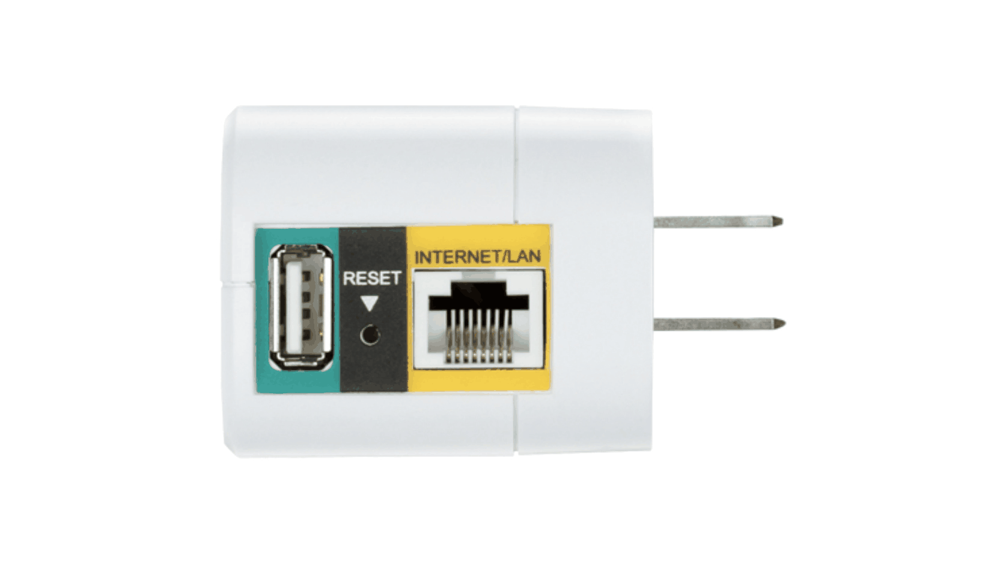

## 前言

1. MT7621的时代，有好多带USB接口的路由器，例如新路由3、小米路由器3G、中兴E8820s、极路由4增强版等，当做无线AP的同时也能顺带共享打印机。但是到了最近的IPQ6000/IPQ8000、MT7981/MT7986，带USB的路由器变得很少见。
2. 解决思路是将无线AP和共享打印的功能拆开由二台机器分别来完成，选中了Dlink DIR-505这款2012年发售的迷你路由器，三围约68×42×51mm，CPU是Atheros AR9330 rev 1，属于MIPS 24Kc V7.4架构，无线150M、有线100M，Coremark跑分966。比较重要的是放在现在都不算太弱的8M闪存+64M内存，而且自带uboot，大大提升了固件编译和刷机的便利性。

产品图片取自Dlink官网：



## 固件编译和下载

1. 本仓库基于<a href="https://github.com/immortalwrt/immortalwrt/">https://github.com/immortalwrt/immortalwrt/</a>的openwrt-18.06分支进行编译，特此感谢。
2. 云编译代码修改自<a href="https://github.com/P3TERX/Actions-OpenWrt">https://github.com/P3TERX/Actions-OpenWrt</a>，特此感谢。
3. 云编译的可调参数，请参考diy-part1.sh、diy-part2.sh。详细使用方式可参考<a href="https://p3terx.com/archives/build-openwrt-with-github-actions.html">这里</a>。
4. 不想看那么多信息的，直接下载固件<a href="https://github.com/w2xg2022/actions4dir505/releases/download/2023.05.26-0700/immortalwrt-ar71xx-generic-dir-505-a1-squashfs-factory.bin">immortalwrt-ar71xx-generic-dir-505-a1-squashfs-factory.bin
</a>。


## 刷机注意事项
1. 卡针捅住RESET键，通电约5秒钟后放开；设置好有线网卡，使用浏览器访问192.168.0.1，选好固件后点击Upload。
2. 默认IP：192.168.0.1，方便刷固件后直接设置。
3. 默认管理员账号、密码：root、未设置密码。
4. 默认WIFI：OpenWrt，未设置密码。
5. 刷好固件后第一次访问192.168.0.1时，如果无法正常显示网页、出现luci报错的画面，请SSH登录后台后运行：

	```bash
	rm -r /tmp/luci-indexcache
	```

自带uboot截屏：


刷机后主页面：


## 软件源设置
1. SSH登录后台运行下列命令以对齐软件源的内核版本号，安装kmod/lib类插件才不会报错。

	```bash
	sed -i  's/b5373b2507a192956dd613063cfdd562/478185b88c0888dfb6dc4cf5decc661d/' /usr/lib/opkg/status
	```


2. OPKG 基础配置

	```bash
	#option check_signature
	```

3. 发行版软件源

	```bash
	src/gz immortalwrt_core https://downloads.immortalwrt.org/releases/18.06-SNAPSHOT/targets/ar71xx/generic/packages
	src/gz immortalwrt_base https://downloads.immortalwrt.org/releases/18.06-SNAPSHOT/packages/mips_24kc/base
	src/gz immortalwrt_luci https://downloads.immortalwrt.org/releases/18.06-SNAPSHOT/packages/mips_24kc/luci
	src/gz immortalwrt_packages https://downloads.immortalwrt.org/releases/18.06-SNAPSHOT/packages/mips_24kc/packages
	src/gz immortalwrt_routing https://downloads.immortalwrt.org/releases/18.06-SNAPSHOT/packages/mips_24kc/routing
	src/gz immortalwrt_telephony https://downloads.immortalwrt.org/releases/18.06-SNAPSHOT/packages/mips_24kc/telephony
	```


## 打印机共享
1. 打印机USB线接到DIR-505的USB接口，开启打印机电源。
2. 网页中点击 网络存储 -> USB 打印服务器，应该能自动识别出打印机型号。
3. 点击 添加 后，只要勾选 启用 即可，其他都用默认值【千万不要勾选双向模式】，然后点击 保存&应用。
4. 在PC中正常添加网络（TCP/IP）打印机。


打印机设置：


## 打赏

如果你觉得这个仓库、说明文档和固件等对你有帮助，欢迎通过微信打赏，谢谢。


